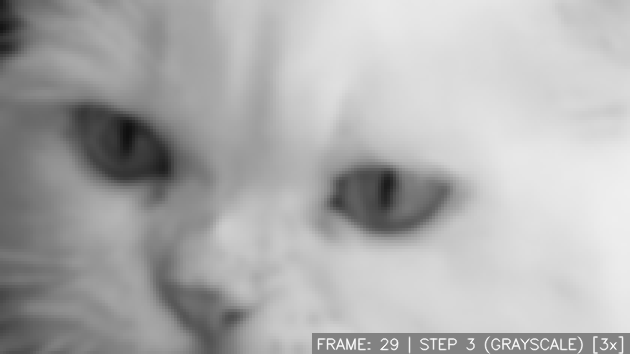
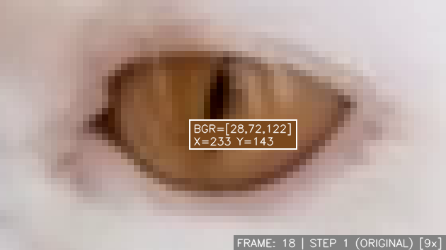
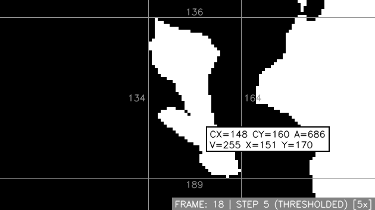
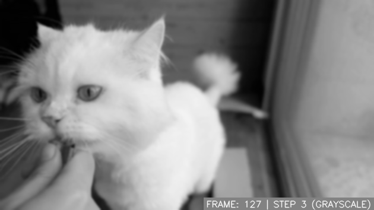

# Computer Vision Playground
An OpenCV-based development & testing space for classical image processing algorithms.

<p align="center">
	
</p>

<p align="center">
<b>Sample processing path</b>
</p>
<div align="center">


</div>

<!-- TOC here -->
<details>
  <summary>Table of Contents</summary>
  <ol>
    <li>
      <a href="#about">About</a>
    </li>
    <li>
      <a href="#setup">Setup</a>
    </li>
    <li>
      <a href="#getting-started">Getting started</a>
      <ul>
        <li><a href="#demo">Demo</a></li>
        <li><a href="#implementing-your-own-algorithms">Implementing your own algorithms</a></li>
      </ul>
    </li>
    <li>
      <a href="#license">License</a>
    </li>
    <li>
      <a href="#bugs-and-contributing">Bugs and contributing</a>
    </li>
  </ol>
</details>

## About
This is a relatively simple set of Python tools helping with development of classical image processing algorithms meant for continuous streams of images, such as videos or live camera streams. You can easily view each step of your image processing algorithm, as well as save each step individually or as a video file.

## Setup
You'll need to install the [requirements](requirements.txt):
```shell
python -m pip install -r requirements.txt
```

## Getting started
### Demo
To play around with the functionalities, simply run
```shell
python src/main.py
```
You can stop at any frame by pressing `c`. You can then jump forwards and back between each step of processing with `a` (one step back) and `d` (one step forward). At any step, you can press `s` in order to save that step separately to an image file. Press `c` again to return to resume, and press `q` at any time to exit.

You can zoom into the image, by using `=` (zoom in) and `-` (zoom out):
<p align="center">
  
</p>

By clicking your left mouse button, you can toggle pixel inspection. For color images, this will tell you the BGR value of the pixel your cursor is over, as well as its X and Y indices:
<p align="center">
  
</p>

While inspecting a binary image (for example after thresholding), you can also view the information about the contour that you hover over:
<p align="center">
  
</p>

You're given the maximum and minimum X and Y values of a contour (gray numbers on image). The center of mass of a contour (`CX=` and `CY=` on the label) and its area (`A=` on the label) will also be displayed. (**NOTE**: The area is calculated using `cv2.contourArea()`, which uses Green's formula to calculate the area. This means that most of the time, the displayed contour area and the actual count of its pixels will not be exactly the same.)

Note that you can change the key mappings to whatever you want in [the config file](config/config.yaml). You can also play around with the config values to get a different result.

### Implementing your own algorithms
You can write your own algorithm by writing the processing steps in [`main.py`](src/main.py). Adding the line 
```py
vis.store(...)
``` 
after each step will let you view your steps one by one. You can also add 
```py
io.save(...)
```
in order to save a specific processing step of every frame into a video file. Note that this should only be called on one processing step, otherwise the video file will be hard to decode.
There are also some simple methods for visualization included in [`visualizer.py`](src/visualizer.py).

Although you can write your processing functions anywhere, it may be easiest to make them methods of 
[the processing class](src/improc.py). This will let you have easy access to all config values.

You can also add your own values to config, in order to support your processing methods. For instance, after adding the value:
```yaml
PROCESSING:
  ...
  MY_PROCESSING:
    SOME_VALUE: 1.5
```
you can access it from the processing class by simply using:
```py
self.CFG.MY_PROCESSING.SOME_VALUE
```

By default, images in inspect mode have a label drawn on them, including information about the current frame and the current processing step:
<p align="center">
 
</p>

You can turn that label off, by replacing the line
```py
done, images_to_save = vis.show(frame_id=frame_id)
```
with
```py
done, images_to_save = vis.show(draw_label=False, frame_id=frame_id)
```
For algorithm development or testing, the only two files you should be modifying are [`main.py`](src/main.py) and [`improc.py`](src/improc.py). However, if you feel the need to modify any other files, feel free to do so!


## License
Distributed under the MIT License. See [`LICENSE`](LICENSE) for more information. If you end up using this repo in a public project, I'd appreciated if you left a link to this repo in your code or in your README.md.


## Bugs and contributing
If you find any bugs, or implement your own features that you'd like merged in the repo, make sure to
submit a PR!
